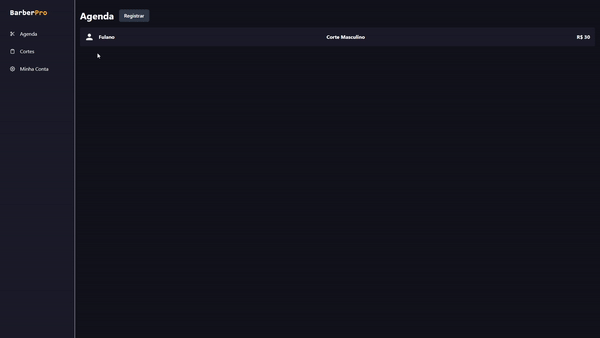
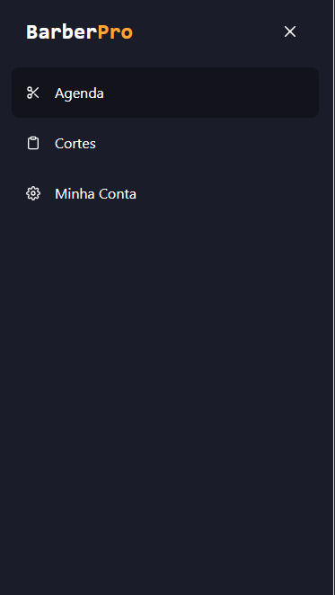
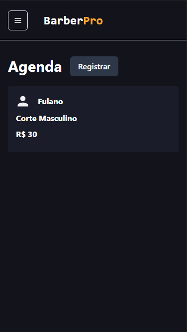
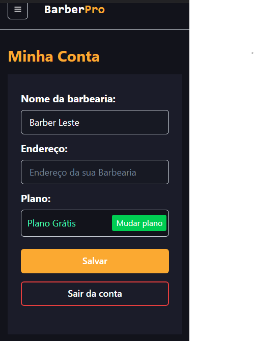
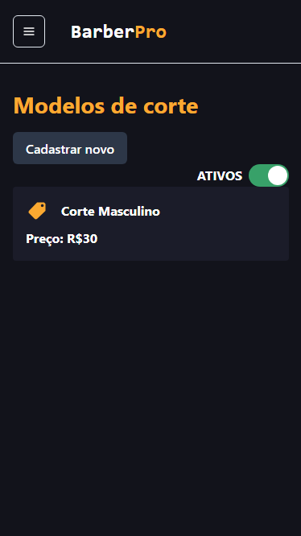
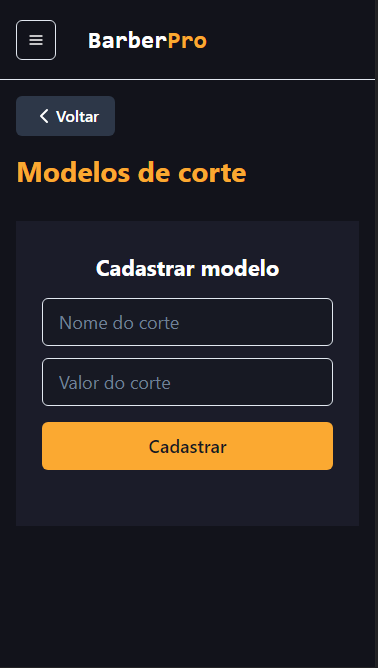

# Barber Pro

# Sobre o projeto

Este projeto é um sistema de uma barbearia que o usuário consegue registrar um modelo de corte definindo o preço e pode atualizar depois.
Também é possivel registrar os clientes informando o nome e o modelo de corte que vai ser realizado. Na agenda pode verificar todos os clientes registrados e é possível abrir um registro e finalizar o serviço.
O sistema possui uma opção de comprar um plano premium, foi utilizado Stripe como um sistema de pagamentos.

## Layout Web 

<div style="display: flex; flex-wrap: wrap;">


</div>

## Layout Mobile

<div style="display: flex; flex-wrap: wrap;">
    
    
    
    
    
    
     
    
</div>


# Tecnologias utilizadas 

- Next.Js
- React.Js
- TypeScript
- Stripe
- Chakra UI

# Pré requisitos

 - Node.js e sistema backend rodando: 

```bash
 # Baixar backend
 git clone https://github.com/leowingss/backend-barberpro.git

 # Instalar dependências e executar o projeto
 yarn install 
 yarn dev
```


# Como rodar o projeto

```bash 
git clone https://github.com/leowingss/sistema-barbearia.git

# Entrar na pasta
cd sistema-barbearia

# Instalar dependências
yarn install ou npm install

# Executar o projeto
yarn dev ou npm run dev

# Abrir projeto

Entrar no http://localhost:3000

``` 